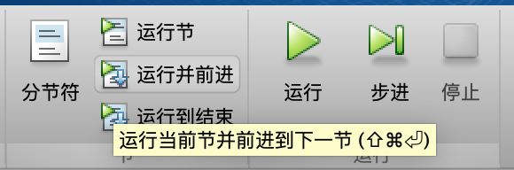

# 操作说明

首先有一个要说明的，由于牌有重叠，使用 testCase.press 的话，会点到牌的右边那个。所以我在每次点击的时候都会把牌移到一个独立的地方，然后点击，这样就不会点击到其他的牌了。这个函数在`press_`里。

## 测试流程

有两种测试方法，一种是使用实时脚本，可以一步一步演示的，一种是一次性演示完。

### 实时脚本方法

在`script_tc1.mlx`和`script_tc2.mlx`里，打开任何一个，可以一节一节执行。



### 一次性演示完毕 

有两种方法，一种是上面实时脚本按右边的运行直接运行完成，另一种是实例化 testCase 的派生类。

```matlab
testCase=tc1;
testCase.launchApp();
testCase.test();
```


以上。